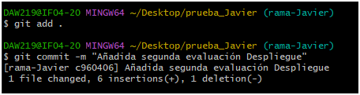

# Ejercicio 5
1. Creación de ramas:
- Crea la rama rama-TUNOMBRE
`$ git branch rama-Javier`

- Posiciona tu carpeta de trabajo en esta rama
`$ git checkout rama-Javier`

2. Añade un fichero y crea la rama remota
- Crea un fichero llamado despligue.md con únicamente una cabecera DESPLIEGUE DE APLICACIONES WEB

- Haz un commit con el mensaje “Añadiendo el archivo despliegue.md en la ramaTUNOMBRE”
`$ git commit -m "Añadiendo el archivo despliegue.md en la rama-Javier"`
 
- Sube los cambios al repositorio remoto. NOTA: date cuenta que ahora se deberá hacer con el comando git push origin rama-TUNOMBRE
`$ git push origin rama-Javier`
 
3. Haz un merge directo
- Posiciónate en la rama master
`$ git checkout main`
 
 - Haz un merge de la rama-TUNOMBRE en la rama master
`$ git merge rama-Javier`
 
4. Haz un merge con conflicto
- En la rama master añade al fichero despliegue.md una tabla en la que muestres los temas de la primera evaluación de Despliegue de Aplicaciones Web
 
- Añade los archivos y haz un commit con el mensaje “Añadida primera evaluación Despliegue”
`$ git commit -m "Añadida primera evaluación Despliegue"`
 
- Posiciónate ahora en la rama-TUNOMBRE
`$ git checkout rama-Javier`
 
- Escribe en el fichero despliegue.md otra tabla con los temas de la segunda evaluación de Despliegue de Aplicaciones Web
 
- Añade los archivos y haz un commit con el mensaje “Añadida tabla segunda evaluación Despliegue”
`$ git add .`
`$ git commit -m "Añadida segunda evaluación Despliegue"`
 
- Posiciónate otra vez en master y haz un merge con la rama-TUNOMBRE
`$ git checkout main`
 
`$ git merge rama-Javier`
 
5. Arregla el conflicto
- Arregla el conflicto editando el fichero despliegue.md y haz un commit con el mensaje “Finalizado el conflicto de despliegue.md”
 
`$ git commit -m "Añadida segunda evaluación Despliegue"`
 
6. Tag y borrar la rama
- Crea un tag llamado v0.2
`$ git tag v0.2`
 
- Borra la rama-TUNOMBRE
`$ git branch -d rama-Javier`
 
 7. Documenta todo y finaliza el ejercicio
 - En el fichero README.md crea una nueva sección en la que vayas documentando todo lo que vas realizando en esta tarea.
 
 - Documenta todos los puntos en el README.md, haz un commit y sube los cambios al servidor 
`$ git add .`
`$ git commit -m "ejercicio 5"`
  